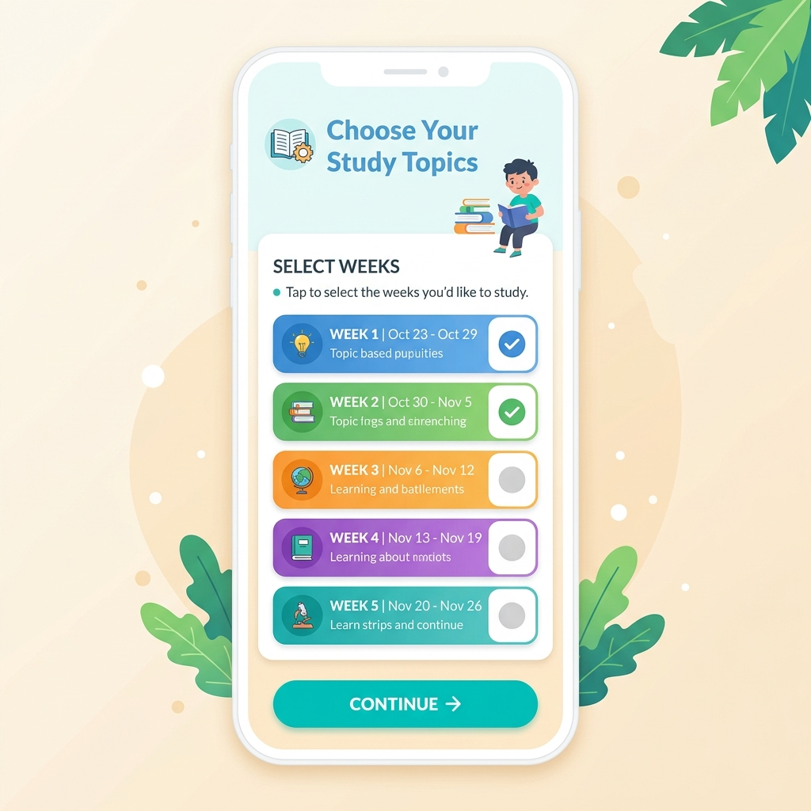
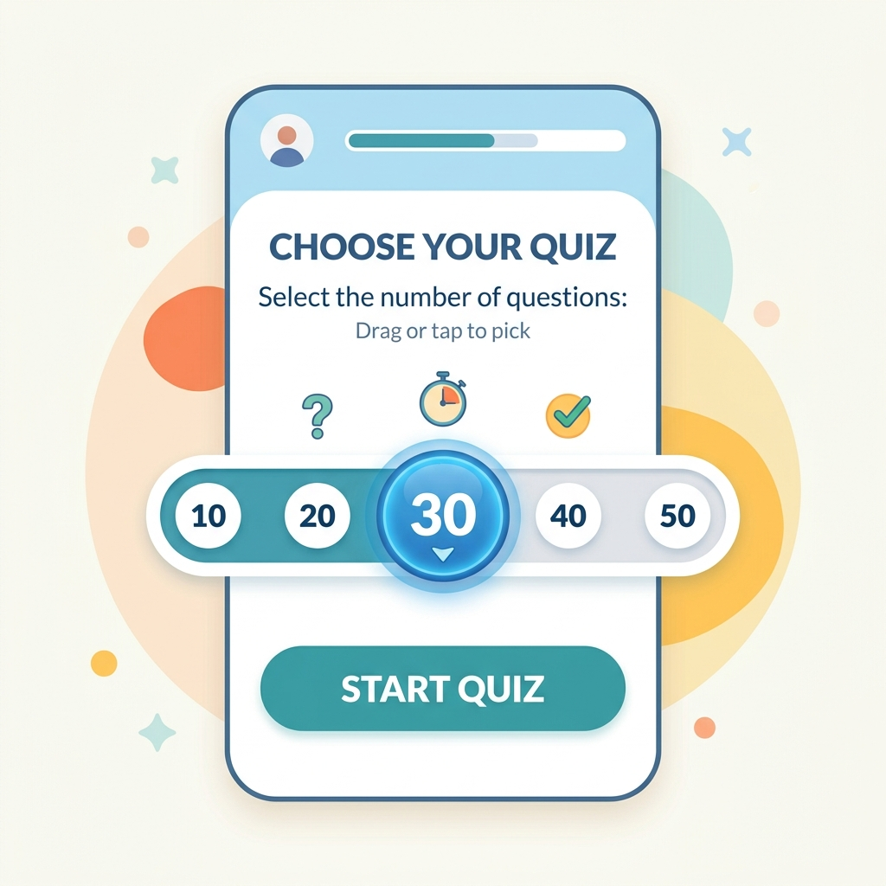
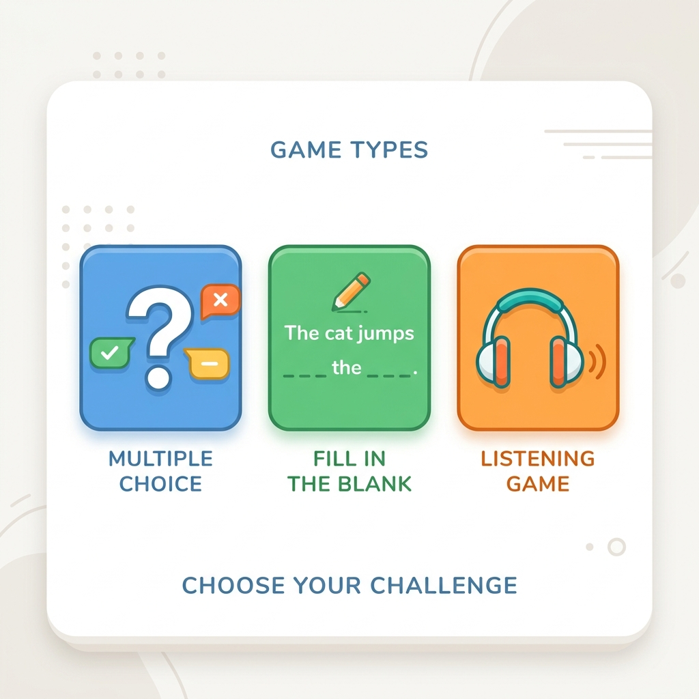

# Hướng Dẫn Sử Dụng Ứng Dụng Học Idiom (Thành Ngữ)
Chào mừng bạn đến với Ứng Dụng Học Idiom! Hướng dẫn này được viết thật đơn giản để giúp bạn dễ dàng làm quen và sử dụng ứng dụng một cách hiệu quả nhất.

---

### 1. Mã Đồng Bộ (Sync Code) Của Bạn 🔄
Mỗi người sử dụng sẽ có một **"Mã Đồng Bộ" (Sync Code)** riêng biệt - giống như một mã số thẻ thành viên của riêng bạn.

* **Tại sao mã này lại quan trọng?** Mã này giúp ứng dụng ghi nhớ bạn đã học được những gì, tỷ lệ trả lời đúng ra sao và đặc biệt là biết được **những từ bạn còn yếu** để giúp bạn ôn tập nhiều hơn.
* **Người dùng mới:** Nếu đây là lần đầu bạn dùng web, ứng dụng sẽ tự động tạo cho bạn một mã mới. Bạn không cần làm gì cả, cứ thế mà học thôi!
* **Người dùng cũ (Hoặc dùng trên máy khác):** Nếu bạn đổi điện thoại hoặc muốn học trên máy tính, bạn chỉ cần bấm vào nút **"Sync"**, nhập mã cũ của mình vào là toàn bộ quá trình học sẽ được tải về đầy đủ.

> 🖼️ **Gợi ý Hình ảnh:** *(Hãy chèn một hình chụp màn hình có khoanh đỏ vào nút "Sync Code" và ô nhập mã ở đây để dễ nhìn nhé)*
> 

---

### 2. Chọn Phạm Vi Bài Học (Scope) 📅
Bạn có thể tự quyết định hôm nay mình muốn học những bài nào. Có 3 lựa chọn chính:

* **Tất cả các tuần - Đều nhau (All weeks - Equal):** Ứng dụng sẽ trộn đều tất cả các câu hỏi từ tất cả các tuần.
* **Tất cả các tuần - Có trọng số (All weeks - Weighted):** Đây là chế độ thông minh! ⚡ Các tuần học mới hơn sẽ xuất hiện nhiều hơn. Những câu thành ngữ bạn hay làm sai cũng sẽ được hỏi lại thường xuyên hơn.
* **Tự chọn tuần (Pick weeks):** Chế độ này dành cho lúc bạn chỉ muốn ôn một số tuần cụ thể. Ví dụ: Bạn sắp thi Tuần 1 và Tuần 2, bạn chỉ việc đánh dấu tick (✔️) vào ô Tuần 1 và Tuần 2 là xong.
* **Ôn tập điểm yếu (Review Weak):** Tập trung hoàn toàn vào các từ vựng bạn hay sai. Ứng dụng sẽ chỉ chọn những thành ngữ bạn trả lời sai nhiều lần để kiểm tra lại, giúp bạn nhanh chóng khắc phục điểm yếu.

> 🖼️ **Gợi ý Hình ảnh:** *(Hãy chèn một hình chụp màn hình phần chọn các tuần học và 3 nút lựa chọn này)*
> 

---

### 3. Số Lượng Câu Hỏi Cho Mỗi Lần Chơi 🔢
Bạn bận rộn hay có nhiều thời gian? Bạn hoàn toàn có thể tự chọn số lượng câu hỏi cho mỗi vòng chơi:

* Ứng dụng có sẵn các mốc cơ bản: **10, 20, 30 hoặc 40 câu**. Bạn chỉ cần bấm chọn.
* Nếu bạn thích một con số khác (ví dụ chỉ muốn học 15 câu), hãy bấm vào nút **"Custom" (Tùy chỉnh)** và gõ số 15 vào. Rất linh hoạt!

> 🖼️ **Gợi ý Hình ảnh:** *(Hãy chèn hình chụp các nút bấm chọn số lượng câu hỏi 10, 20, 30, 40 và ô Custom)*
> 

---

### 4. Các Trò Chơi Ôn Tập (Games) 🎮
Để việc học không bị nhàm chán, ứng dụng cung cấp 3 loại trò chơi khác nhau:

1. **Trắc Nghiệm (Multiple Choice):** Quen thuộc và dễ nhất! Ứng dụng sẽ hiện ra một câu hỏi (thường là ý nghĩa của từ), bạn chọn 1 đáp án đúng trong 4 đáp án A, B, C, D.
2. **Điền Vào Chỗ Trống (Fill in the Blank):** Ứng dụng sẽ đưa ra một câu tiếng Anh bị khuyết một cụm từ. Nhiệm vụ của bạn là đọc và tìm cụm từ chính xác nhất để điền vào để câu có nghĩa.
3. **Luyện Nghe (Listening Quiz):** Trò chơi giúp bạn luyện tai! Bạn sẽ nghe một đoạn âm thanh ngắn đọc lên một cụm từ. Sau đó bạn cần chọn đúng từ mình vừa nghe được.

> 🖼️ **Gợi ý Hình ảnh:** *(Hãy chèn hình chụp 3 nút chọn trò chơi hoặc màn hình của 3 trò chơi này)*
> 

---

**Chúc bạn có những giờ học thật vui và bổ ích!**
